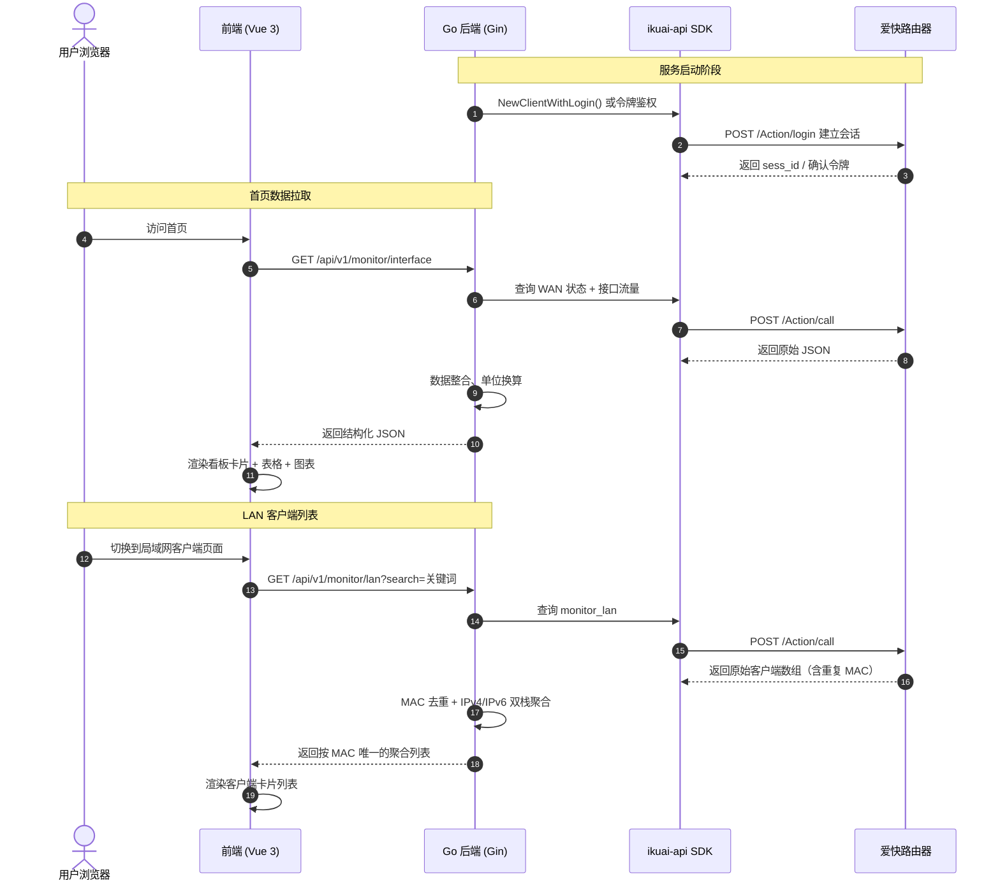

# iKuai4 路由器流量监控系统 — 系统设计文档

> **版本**: v0.1.0  
> **最后更新**: 2026-05-23  
> **状态**: 方案确定，待实施

---

## 一、项目概述

### 1.1 项目背景

iKuai（爱快）是一款国内广泛使用的企业级软路由系统。其网页管理后台虽然功能完善，但界面设计较为传统，且不提供对外的标准接口文档。

本项目旨在基于爱快路由器的内部 HTTP 接口，搭建一个**前后端分离的现代化流量监控面板**，提供更直观、更美观的网络监控体验。

### 1.2 核心目标

1. **首页看板**：展示实时上传/下载速率、总连接数、WAN 口状态、各物理接口流量明细
2. **局域网客户端列表**：按 MAC 地址去重聚合，支持 IPv4/IPv6 双栈展示，支持备注模糊搜索
3. **流量趋势图表**：通过 ECharts 展示实时上传/下载速率的历史波动曲线

### 1.3 设计原则

- **安全优先**：爱快接口令牌 / 账号密码仅存储在后端，前端不接触任何鉴权信息
- **模拟优先**：后端内置高保真模拟数据，无需连接真实路由器即可完整开发调试前端
- **现代化美学**：暗黑极客风，拒绝传统企业级 UI 框架的呆板感

---

## 二、技术栈

### 2.1 后端

| 角色         | 技术选型                                | 说明                              |
|------------|---------------------------------------|-----------------------------------|
| 语言         | Go 1.26+                             |                                   |
| Web 框架     | `github.com/gin-gonic/gin`            | 高性能路由与中间件                       |
| 日志         | `go.uber.org/zap`                     | 结构化高性能日志                         |
| 爱快 SDK     | `github.com/zy84338719/ikuai-api`     | 社区维护的爱快 Go 客户端，支持 v3/v4 系统版本   |
| 配置管理       | 环境变量                                | 通过 `os.Getenv` 读取，简洁无依赖          |

### 2.2 前端

| 角色         | 技术选型                           | 说明                                     |
|------------|----------------------------------|------------------------------------------|
| 框架         | Vue 3                            | 组合式 API + `<script setup>` 语法           |
| 构建工具       | Vite 8（Rolldown 编译器）            | 毫秒级冷启动，极快热更新                         |
| 包管理器       | pnpm                             | 硬链接机制，节省磁盘空间                         |
| CSS        | Tailwind CSS 4                   | 原子化样式，高度自定义暗黑极客风                     |
| 无样式组件     | Radix-Vue                        | 无预设样式的底层组件（弹窗、下拉等），完全自定义外观          |
| 图表         | ECharts 6                        | 定制暗黑风发光贝塞尔折线图                        |
| 动效         | Motion（Motion One）               | 数据变动时的丝滑数字滚动与微弹簧过渡                   |
| HTTP 客户端   | Axios                            | 请求后端接口                               |
| 图标         | Lucide Vue Next                  | 轻量矢量图标库                               |

### 2.3 技术栈选型决策记录

**Q: 为什么不用 Element Plus / Ant Design？**

这些是传统的"全样式"企业级 UI 框架，内置了大量厚重的表格、表单默认样式（蓝色背景、规矩圆角、硬边框），天然带有"B 端管理系统味"。要改造成暗黑极客风需要写大量覆盖样式，事倍功半。

我们选择 **Radix-Vue**（无样式组件）+ **Tailwind CSS**（原子化自由定制），相当于拿到"毛坯房"的钢结构骨架，完全自由地打造视觉效果，零覆盖样式代码。这也是 Vercel、Linear、Supabase 等现代极客产品的主流方案。

---

## 三、系统架构

### 3.1 整体拓扑

```
┌──────────────────┐     REST 风格 JSON 接口   ┌──────────────────────┐     POST /Action/call     ┌──────────────┐
│                  │  ◄─────────────────────►  │                      │  ◄─────────────────────►  │              │
│   前端 (Vue 3)    │    http://localhost:5173   │   Go 后端 (Gin)       │    Bearer 令牌鉴权         │  爱快路由器     │
│   Vite 开发服务    │                          │   http://localhost:8080│                          │  192.168.x.x  │
│                  │                          │                      │                          │              │
└──────────────────┘                          └──────────────────────┘                          └──────────────┘
```

### 3.2 数据流时序



### 3.3 安全设计

> **核心原则：爱快鉴权信息绝不暴露给前端。**

- 爱快的接口令牌或账号密码仅保存在 Go 后端（环境变量或加密配置文件）
- 用户访问前端时，前端只与 Go 后端通信，不直接接触爱快路由器
- Go 后端作为**安全代理**，对上游数据进行脱敏和整理后再返回给前端
- 后续如需用户登录，由 Go 后端自建 JWT 鉴权体系，与爱快鉴权完全解耦

---

## 四、爱快接口通信机制

### 4.1 协议概述

爱快路由器的管理后台接口不是标准 REST 风格接口，而是**单一入口的 JSON-RPC 风格**：

- **请求地址**：`POST http(s)://<路由器IP>/Action/call`
- **内容类型**：`application/json`
- **请求载荷格式**：

```json
{
  "func_name": "功能模块名",
  "action": "操作类型 (show / add / edit / del)",
  "param": { "参数键": "参数值" }
}
```

### 4.2 鉴权方式

| 版本 | 方式 | 说明 |
|------|------|------|
| V3   | 账号密码 | 请求 `/Action/login`，获取 `sess_id` Cookie，后续请求携带 |
| V4   | 接口令牌 | 在路由器后台生成令牌，请求头携带 `Authorization: Bearer <token>` |

> 我们使用的 `ikuai-api` SDK 已封装了上述认证流程，自动管理 Cookie 和会话维持。

### 4.3 本项目涉及的 func_name

| func_name       | action | 用途                     | 对应前端页面         |
|----------------|--------|--------------------------|---------------------|
| `wan`          | `show` | WAN 口连接状态与 IP         | 首页 WAN 状态表      |
| `monitor_iface`| `show` | 各物理接口实时上下行流量与连接数 | 首页流量详情表        |
| `monitor_lan`  | `show` | 局域网在线客户端列表          | 局域网客户端页面      |

---

## 五、后端设计

### 5.1 项目结构

```
backend/
├── cmd/
│   └── server/
│       └── main.go              # 程序入口
├── internal/
│   ├── config/
│   │   └── config.go            # 全局配置（环境变量读取）
│   ├── logger/
│   │   └── logger.go            # Zap 日志初始化
│   ├── service/
│   │   └── monitor.go           # 核心业务逻辑：数据抓取、MAC 聚合、模拟数据
│   └── controller/
│       └── monitor.go           # Gin HTTP 处理器 + CORS 中间件
├── go.mod
└── go.sum
```

### 5.2 接口定义

#### 5.2.1 健康检查

```
GET /health
```

```json
{
  "status": "healthy",
  "mode": "mock"
}
```

#### 5.2.2 首页看板数据

```
GET /api/v1/monitor/interface
```

**响应**：

```json
{
  "code": 200,
  "data": {
    "summary": {
      "upload_speed": 8619212,
      "download_speed": 313006,
      "total_connections": 955
    },
    "wan_status": [
      {
        "name": "wan1",
        "ip": "123.118.2.47",
        "proto": "PPPOE",
        "status": "success",
        "comment": "主力电信"
      }
    ],
    "traffic_details": [
      {
        "name": "lan1",
        "ip": "192.168.50.1",
        "upload_speed": 8524922,
        "download_speed": 372834,
        "total_up": 3375253815296,
        "total_down": 2253965529088,
        "connections": 0,
        "comment": ""
      }
    ]
  }
}
```

> **数值单位约定**：所有速率字段为 **字节/秒（Bytes/s）**，所有流量总量字段为 **字节（Bytes）**。前端负责格式化为 KB/s、MB/s、GB、TB 等可读单位。

#### 5.2.3 局域网客户端列表

```
GET /api/v1/monitor/lan?search=关键词
```

| 参数     | 类型   | 必填 | 说明                         |
|---------|--------|------|------------------------------|
| search  | string | 否   | 按备注（comment）模糊搜索，大小写无关 |

**响应**：

```json
{
  "code": 200,
  "data": [
    {
      "mac": "00:22:1F:97:F2:CD",
      "ips": [
        "10.10.10.104",
        "2408:8207:1920:6d52:014c:b5b4:c506:aafe"
      ],
      "upload_speed": 2887,
      "download_speed": 1925,
      "total_up": 42144825344,
      "total_down": 5282922496,
      "connections": 18,
      "comment": "研发中心-iMac Pro"
    }
  ]
}
```

### 5.3 MAC 去重与双栈聚合算法

爱快的 `monitor_lan` 接口会为同一设备的每个 IP 地址返回一条独立记录。例如一台同时拥有 IPv4 和 IPv6 的设备会出现两条数据，MAC 相同但 IP 不同。

**后端处理逻辑**：

1. 从 SDK 拉取原始客户端数组
2. 以 `MAC`（转大写）为 Key 构建 `map[string]*ClientDTO`
3. 遍历原始数组：
   - 若 MAC 已存在：将 IP 追加到 `ips` 数组（去重），流量指标累加
   - 若 MAC 不存在：新建记录
4. 将 map 转换为 slice 返回

```
原始数据（3条）                     聚合后（1条）
┌─────────────────────┐           ┌──────────────────────────────┐
│ MAC: AA:BB:CC:DD:EE  │           │ MAC: AA:BB:CC:DD:EE           │
│ IP:  10.10.10.100    │           │ IPs: [10.10.10.100,           │
│ Up:  1000            │    ──►    │       2408:8207:...:aafe,     │
├─────────────────────┤           │       2408:8207:...:5f13]     │
│ MAC: AA:BB:CC:DD:EE  │           │ Upload:  1000 + 500 + 200     │
│ IP:  2408:...:aafe   │           │ Download: 2000 + 800 + 100    │
│ Up:  500             │           │ Connections: 10 + 5 + 2       │
├─────────────────────┤           └──────────────────────────────┘
│ MAC: AA:BB:CC:DD:EE  │
│ IP:  2408:...:5f13   │
│ Up:  200             │
└─────────────────────┘
```

### 5.4 模拟模式

后端内置高保真模拟数据源，通过环境变量 `MOCK_MODE=true`（默认开启）控制：

- 模拟 3 个 WAN 口（电信 PPPoE、联通 PPPoE、DHCP 备用）
- 模拟 11 台局域网设备（含双栈 IPv4/IPv6、不同设备类型）
- 速率数据带有随机波动，模拟真实网络场景

**切换到真实模式**：设置以下环境变量即可：

```bash
export IKUAI_URL=http://192.168.9.1
export IKUAI_USERNAME=admin
export IKUAI_PASSWORD=your_password
# 或使用 V4 令牌鉴权：
# export IKUAI_API_TOKEN=your_token
```

### 5.5 配置项一览

| 环境变量           | 默认值               | 说明                   |
|-------------------|---------------------|------------------------|
| `PORT`            | `8080`              | 后端监听端口              |
| `MOCK_MODE`       | `true`              | 是否使用模拟数据           |
| `IKUAI_URL`       | `http://192.168.9.1`| 爱快路由器地址             |
| `IKUAI_USERNAME`  | `admin`             | 爱快登录账号              |
| `IKUAI_PASSWORD`  | 空                   | 爱快登录密码              |
| `IKUAI_API_TOKEN` | 空                   | 爱快 V4 接口令牌（优先） |

---

## 六、前端设计

### 6.1 项目结构

```
frontend/
├── public/
├── src/
│   ├── assets/
│   │   └── main.css              # Tailwind 入口 + 全局 CSS 变量
│   ├── components/
│   │   ├── layout/
│   │   │   ├── AppHeader.vue     # 顶部导航栏（页面切换标签页）
│   │   │   └── AppLayout.vue     # 全局布局容器
│   │   ├── monitor/
│   │   │   ├── SummaryCard.vue   # 首页大数字指标卡片（上传/下载/连接数）
│   │   │   ├── WanStatusTable.vue# WAN 接口状态表
│   │   │   ├── TrafficTable.vue  # 接口流量详情表
│   │   │   └── TrafficChart.vue  # ECharts 实时流量折线图
│   │   └── lan/
│   │       ├── ClientCard.vue    # 单个客户端行卡片
│   │       ├── ClientList.vue    # 客户端列表容器
│   │       └── SearchBar.vue     # 备注搜索框
│   ├── composables/
│   │   ├── useMonitor.js         # 首页数据组合函数（轮询逻辑）
│   │   ├── useLanClients.js      # 局域网客户端数据组合函数
│   │   └── useFormatters.js      # 单位格式化工具（Bytes → KB/MB/GB/TB）
│   ├── api/
│   │   └── monitor.js            # Axios 封装，统一管理后端接口请求
│   ├── views/
│   │   ├── MonitorInterface.vue  # 首页看板页面
│   │   └── MonitorLan.vue        # 局域网客户端页面
│   ├── App.vue
│   └── main.js
├── index.html
├── vite.config.js
├── package.json
└── pnpm-lock.yaml
```

### 6.2 页面设计

#### 6.2.1 首页看板

```
┌──────────────────────────────────────────────────────────────────────┐
│  ● 首页看板                                      局域网客户端       │
├──────────────────────────────────────────────────────────────────────┤
│                                                                      │
│  ┌────────────────┐  ┌────────────────────────────────────────────┐  │
│  │  ▲ 当前上传      │  │ WAN 接口状态                                │  │
│  │  8.22 MB/s     │  │ ┌──────┬──────────────┬───────┬─────────┐ │  │
│  │                │  │ │ wan1 │ 123.118.2.47 │ PPPoE │ ● 正常  │ │  │
│  ├────────────────┤  │ │ wan2 │ 123.118.3.80 │ PPPoE │ ● 正常  │ │  │
│  │  ▼ 当前下载      │  │ │ wan3 │ 192.168.1.3  │ DHCP  │ ● 正常  │ │  │
│  │  305.67 KB/s   │  │ └──────┴──────────────┴───────┴─────────┘ │  │
│  │                │  ├────────────────────────────────────────────┤  │
│  ├────────────────┤  │ 接口流量详情                                │  │
│  │  ◎ 总连接数     │  │ ┌──────┬──────────────┬────────┬────────┐ │  │
│  │  955           │  │ │ lan1 │ 192.168.50.1 │↑8.13MB │↓364KB  │ │  │
│  │                │  │ │ wan1 │ 123.118.2.47 │↑7.63MB │↓265KB  │ │  │
│  └────────────────┘  │ │ wan2 │ 123.118.3.80 │↑608KB  │↓39KB   │ │  │
│                      │ └──────┴──────────────┴────────┴────────┘ │  │
│                      └────────────────────────────────────────────┘  │
│                                                                      │
│  ┌──────────────────────────────────────────────────────────────────┐│
│  │          ⌇ 实时流量趋势 (ECharts 双折线图，60秒滚动)               ││
│  │   ─── 上传速率 (绿色)     ─── 下载速率 (蓝色)                     ││
│  │  ╱╲      ╱╲                                                     ││
│  │ ╱  ╲────╱  ╲───────────                                         ││
│  │╱                                                                ││
│  └──────────────────────────────────────────────────────────────────┘│
└──────────────────────────────────────────────────────────────────────┘
```

#### 6.2.2 局域网客户端

```
┌──────────────────────────────────────────────────────────────────────┐
│  首页看板                                      ● 局域网客户端       │
├──────────────────────────────────────────────────────────────────────┤
│                                                                      │
│  ┌─ 搜索 ──────────────────────────┐                                │
│  │  🔍 通过备注过滤...              │                                │
│  └─────────────────────────────────┘                                │
│                                                                      │
│  Mac              IP                    ↑上传    ↓下载    连接  总消耗 │
│  ┌──────────────────────────────────────────────────────────────────┐│
│  │ 00:22:1F:97:F2:CD  10.10.10.104     2.82KB  1.88KB   18  44GB  ││
│  │ 研发中心-iMac Pro   2408:8207:...:aafe                          ││
│  ├──────────────────────────────────────────────────────────────────┤│
│  │ 00:70:FA:3D:30:10  10.10.10.103     39.0KB  39.0KB   15  38GB  ││
│  │ 李总的 MacBook Pro  2408:8207:...:5876                          ││
│  ├──────────────────────────────────────────────────────────────────┤│
│  │ DA:8A:9F:53:43:2D  192.168.50.254   0       0        4   1.5MB ││
│  │ 前台访客 iPad                                                    ││
│  └──────────────────────────────────────────────────────────────────┘│
└──────────────────────────────────────────────────────────────────────┘
```

### 6.3 视觉设计规范

#### 6.3.1 配色系统

```css
:root {
  /* 背景层次 */
  --bg-main:         #060813;                     /* 深空黑主背景 */
  --bg-card:         rgba(22, 28, 45, 0.45);      /* 半透明磨砂玻璃卡片 */
  --bg-card-hover:   rgba(22, 28, 45, 0.7);       /* 卡片悬浮态 */

  /* 边框 */
  --border-card:     rgba(16, 185, 129, 0.08);    /* 极细内发光绿色边框 */
  --border-active:   rgba(16, 185, 129, 0.25);    /* 激活态边框 */

  /* 品牌色 */
  --neon-green:      #10b981;                     /* 荧光绿主色 Emerald 500 */
  --neon-cyan:       #06b6d4;                     /* 极客青色 Cyan 500 */
  --neon-glow:       rgba(16, 185, 129, 0.25);    /* 绿色发光阴影 */

  /* 文字 */
  --text-primary:    #f8fafc;                     /* Slate 50 主文字 */
  --text-muted:      #64748b;                     /* Slate 500 副文字 */

  /* 语义色 */
  --status-success:  #10b981;                     /* 在线/正常 */
  --status-error:    #ef4444;                     /* 离线/异常 */
  --speed-upload:    #10b981;                     /* 上传用绿色 */
  --speed-download:  #3b82f6;                     /* 下载用蓝色 */
}
```

#### 6.3.2 设计关键词

- **磨砂玻璃态**：卡片使用 `backdrop-blur` + 半透明背景
- **荧光发光**：关键数字和状态指示带有微弱发光阴影
- **微交互**：表格行悬浮时微上浮 + 左侧出现绿色指示线
- **数字滚动**：速率数字变化时使用平滑过渡动画而非直接替换
- **等宽字体**：MAC 地址、IP 地址、速率数值全部使用 `font-mono`

#### 6.3.3 字体

- **标题与正文**：Inter / system-ui（系统默认无衬线）
- **数据与代码**：JetBrains Mono / monospace（等宽字体，提升极客科技感）

### 6.4 数据轮询策略

| 页面              | 轮询间隔  | 说明                        |
|------------------|---------|-------------------------------|
| 首页看板          | 3 秒    | 刷新速率卡片 + 流量表格 + 图表追加数据点 |
| 局域网客户端       | 5 秒    | 刷新客户端列表                    |

- 使用 `setInterval` + `onUnmounted` 自动清理
- 切换标签页时暂停非当前页面的轮询，减少不必要的请求

### 6.5 单位格式化规则

前端统一使用以下逻辑将后端返回的字节数转为可读格式：

```
formatSpeed(bytesPerSec):
  < 1024          → "xxx B/s"
  < 1024²         → "xxx.xx KB/s"
  < 1024³         → "xxx.xx MB/s"
  ≥ 1024³         → "xxx.xx GB/s"

formatBytes(bytes):
  < 1024          → "xxx B"
  < 1024²         → "xxx.xx KB"
  < 1024³         → "xxx.xx MB"
  < 1024⁴         → "xxx.xx GB"
  ≥ 1024⁴         → "xxx.xx TB"
```

---

## 七、ECharts 图表设计

### 7.1 实时流量趋势图

- **类型**：双线平滑面积折线图
- **X 轴**：最近 60 个时间点（每 3 秒采集一次，共 3 分钟窗口）
- **Y 轴**：自适应速率单位
- **上传线**：荧光绿 `#10b981`，带从上至下的渐变半透明面积填充
- **下载线**：蓝色 `#3b82f6`，同样带渐变面积填充
- **背景**：与卡片一致的深色 `#151722`
- **网格线**：极暗灰 `#1f2937`，不抢视觉焦点
- **提示框**：暗色背景 + 绿色边框，跟随鼠标

### 7.2 数据管理

- 前端维护一个长度为 60 的滚动数组
- 每次轮询返回新数据时，`push` 新值并 `shift` 最旧值
- ECharts 使用 `setOption` 增量更新，不重建实例

---

## 八、开发计划

### 阶段 1：后端骨架 + 模拟数据（~1天）

- [ ] 整理项目目录结构（go.mod 位置、backend/ 子目录）
- [ ] 实现 config、logger、service、controller 四层
- [ ] 内置高保真模拟数据
- [ ] 验证 `GET /api/v1/monitor/interface` 和 `GET /api/v1/monitor/lan` 返回正确

### 阶段 2：前端骨架 + 页面搭建（~2天）

- [ ] 配置 Tailwind CSS 暗黑主题
- [ ] 实现全局布局 + 顶部标签页导航
- [ ] 实现首页看板（指标卡片 + 表格 + ECharts 图表）
- [ ] 实现局域网客户端列表（卡片行 + 搜索过滤）
- [ ] 添加轮询逻辑与微动效

### 阶段 3：前后端联调（~0.5天）

- [ ] Vite 配置代理到 Go 后端
- [ ] 调通前后端数据流
- [ ] 验证模拟模式下全套页面正常运行

### 阶段 4：真实路由器对接（按需）

- [ ] 配置真实爱快路由器的 IP 和令牌
- [ ] 验证 SDK 连接与数据抓取
- [ ] 根据真实数据微调前端展示

---

## 九、参考资料

- [ikuai-api Go SDK](https://github.com/zy84338719/ikuai-api) — 爱快 Go 客户端库
- [ikuai-cli](https://github.com/ikuaios/ikuai-cli) — 爱快命令行工具（参考其 API 调用方式）
- [Radix-Vue](https://www.radix-vue.com/) — Vue 3 无样式 UI 组件库
- [Tailwind CSS](https://tailwindcss.com/) — 原子化 CSS 框架
- [ECharts](https://echarts.apache.org/) — 图表库
- [Motion One](https://motion.dev/) — 动效库
